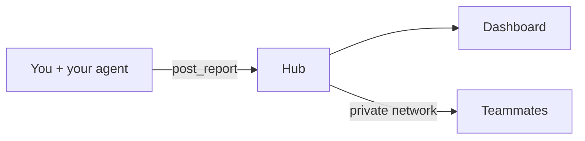

<p align="center">
  
</p>

<p align="center">
  A report inbox for AI agents.<br>
  Agents publish HTML; you browse and share it over your private network — never the public internet.
</p>

---

## What is this?

Hub is a tiny self-hosted app that collects HTML reports your AI agents write — architecture notes, data reviews, postmortems, anything worth keeping.

You get a clean dashboard. Reports are reachable only on your private network (a Tailscale tailnet or a company VPN), never the public internet. Run it just for yourself, or host **one shared instance** your whole team publishes to and reads from.



---

## Getting started

There are two paths. Pick one.

### A. Use a shared Hub (zero install)

If someone already runs Hub on a server your team can reach (a devbox, a VPC box), just point your agent at it — no clone, no Python:

```bash
claude mcp add --transport http hub http://<server>:8000/mcp
```

Restart your agent. `post_report` and the other tools now publish to the shared Hub. Open `http://<server>:8000` in a browser to read reports.

### B. Host your own

**You need:** [uv](https://docs.astral.sh/uv/), an agent host (Claude Code, Cursor, Codex, Grok), and Tailscale connected if you want to share.

```bash
git clone https://github.com/gabrycina/hub.git
cd hub
uv sync && uv run hub init --mcp
```

That's it. Hub will:

1. Create `~/.config/hub/` (config, token, reports)
2. Register MCP with your agents
3. Start the server at **http://127.0.0.1:17482**
4. Set up **Tailscale Serve** for `.ts.net` links

If a browser tab opens, approve Tailscale Serve once — then restart your agent. To host for a whole team instead, see **Hosting modes** below.

**Check everything:**

```bash
uv run hub status
```

---

## Daily use

| What | How |
|------|-----|
| Browse reports | Open the dashboard at your local, `.ts.net`, or server URL |
| Publish a report | Ask your agent: *"Publish this to Hub"* |
| Share with a colleague | Send them the report link (works for anyone on the same tailnet/VPN) |
| Keep something private | Default is `private` (only matters in local mode — see below) |

---

## Commands

```bash
uv run hub init --mcp        # host locally, exposed over Tailscale Serve
uv run hub init --server     # host for a team (binds 0.0.0.0, network-trusted)
uv run hub connect --url <u> --token <t> --mcp   # local client of a shared Hub
uv run hub up [--no-serve]   # start the server
uv run hub status            # health check
```

Zero-install client of a shared Hub (no clone needed):

```bash
claude mcp add --transport http hub http://<server>:8000/mcp
```

Port **17482** by default. Override with `HUB_PORT` in `~/.config/hub/config.env`.

---

## More docs

- [Tailscale setup](docs/tailscale.md)
- [MCP details](docs/mcp-claude-code.md)
- [Security model](docs/security.md)

MIT · [github.com/gabrycina/hub](https://github.com/gabrycina/hub)

---

# For agents

If you're setting up or using Hub on behalf of a user, follow this section. **Run commands yourself** — don't just tell the user what to run.

## Quick check

```bash
uv run hub status
```

| Output | Action |
|--------|--------|
| `initialized: false` | Run setup below |
| `initialized: true`, `running: false` | MCP auto-starts Hub; or `uv run hub up` |
| `initialized: true`, `running: true` | Ready — publish |

Verify MCP is registered (Claude Code):

```bash
claude mcp list | grep -q hub && echo "ok" || echo "missing"
```

Claude Code, Grok, and Codex are registered through their own CLIs (Claude Code at user scope, so Hub is available in every project); Cursor is written to `~/.cursor/mcp.json`. `hub init --mcp` and `hub connect --mcp` configure all detected agents.

## Hosting modes

Hub runs one of three ways. Pick based on who hosts.

**1. Local (default)** — host on the user's machine, exposed to their tailnet over **Tailscale Serve**. Viewing is identity-gated (Serve injects each viewer's Tailscale identity). Reports are private by default; the user shares individual ones over the tailnet.

```bash
uv run hub init --mcp
```

**2. Server** — host on an always-on box (e.g. a company devbox) that teammates reach directly by IP, no Tailscale Serve. Use this for a shared team inbox, or when Serve isn't enabled on the tailnet.

```bash
# On the server/devbox:
uv run hub init --server --site-name "Gen AI" --public-url http://<server-ip>:8000
uv run hub up --no-serve
```

Server mode sets `HUB_HOST=0.0.0.0` and `HUB_TRUST_NETWORK=true`: the network (VPN/tailnet) is the access boundary, so anyone who can reach the server can view and publish **every** report. `--site-name` brands the dashboard title (e.g. "Gen AI Hub"); without it the setup prompts for a name. Pick a port your network allows (devbox security groups often pre-open `8000-8003`). The command prints the teammate onboarding lines.

**3. Connect to a shared Hub** — don't host anything; point agents at a server someone else runs. Two ways:

```bash
# Zero install (recommended) — the server hosts the MCP at /mcp:
claude mcp add --transport http hub http://<server-ip>:8000/mcp

# Or a local MCP client (needs this repo + uv):
uv run hub connect --url http://<server-ip>:8000 --token <server-token> --mcp
```

The zero-install path needs nothing but the `claude` CLI. `hub connect` writes `HUB_URL` + `HUB_API_TOKEN` to config and runs no local server (the MCP entrypoint skips it when `HUB_URL` is set). Restart the agent afterward.

## Install the publish skill (recommended)

```bash
mkdir -p ~/.grok/skills/hub-publish ~/.claude/skills/hub-publish
cp skills/hub-publish/* ~/.grok/skills/hub-publish/
cp skills/hub-publish/* ~/.claude/skills/hub-publish/
```

Or per-project: `.claude/skills/hub-publish/`

## Verify MCP tools

You should see: `post_report`, `list_reports`, `set_report_visibility`, `get_report_url`

## Publishing a report

1. **Ask visibility** if unclear: `private` (default) or `shareable`. Note: in **server mode** the network is the boundary, so everyone who can reach the server sees every report regardless — warn before publishing sensitive content there.
2. **Generate HTML** from `skills/hub-publish/template.html` — replace `{{title}}`, `{{body}}`, `{{generated_at}}`. Keep CSS inline. For Mermaid, use `<pre class="mermaid">` and escape `&` as `&amp;`. Keep each node label on one line — no `<br/>` inside labels (in a `<pre>` it becomes a real newline and Mermaid throws a syntax error). Hub themes Mermaid by the viewer's OS dark/light setting; if your page has a fixed background, pin the diagram colors with a first-line directive like `%%{init: {'theme':'neutral'}}%%`.
3. **Publish:**

```
post_report(
  html=<full html>,
  title="Q2 Metrics Dashboard",
  visibility="shareable",
  tags=["metrics"],
  project="growth"
)
```

4. **Return the `url`** from the response. Reachable on the tailnet/VPN, not the public internet.

## MCP tools

| Tool | Use |
|------|-----|
| `post_report` | Publish HTML (new report, new URL) |
| `update_report` | Edit an existing report in place — same id and URL |
| `read_report` | Read a report's HTML by id or URL (consume another agent's report) |
| `list_reports` | List reports (`scope`: `mine`, `shared`, `all`) |
| `set_report_visibility` | Toggle `private` / `shareable` |
| `get_report_url` | Get link for existing report |

To **revise** a report, call `update_report(report_id, html=...)` rather than `post_report` — it keeps the link stable instead of minting a new one. To **consume** a report another agent published, pass its link (or id) to `read_report`. Server `prompts` also expose `/publish` and `/read` slash commands.

A local stdio MCP loads config from `~/.config/hub/config.env`; a remote MCP (`--transport http`) runs on the server and needs nothing locally.

## Troubleshooting

**Tools missing** → `uv run hub init --mcp` (or re-add the remote MCP), restart agent

**`post_report` connection error** → make sure the Hub is running (`uv run hub up`, or check the server is up)

**`.ts.net` link fails (local mode)** → `uv run hub status`, check `serve: needs_enable`, run `uv run hub serve-setup`

**Server link unreachable** → confirm the viewer is on the same VPN/tailnet and the port is open on the host

**Report not visible to colleague (local mode)** → visibility must be `shareable`, not `private`
