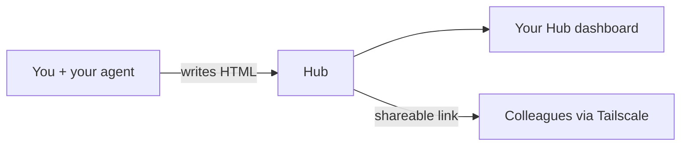

<p align="center">
  
</p>

<p align="center">
  Your personal report inbox.<br>
  Agents publish HTML. Browse locally — share securely over Tailscale when you want to.
</p>

---

## What is this?

Hub is a tiny self-hosted app that collects HTML reports your AI agents write — architecture notes, data reviews, postmortems, anything worth keeping.

You get a clean dashboard called **Your Hub**. Reports stay private by default; when you want to share, links go to colleagues over your Tailscale network — never the public internet.



---

## Setup (2 minutes)

**You need:** [uv](https://docs.astral.sh/uv/), Tailscale connected (for sharing), and an agent host like Claude Code or Grok Build.

```bash
git clone https://github.com/gabrycina/hub.git
cd hub
uv sync && uv run hub init --mcp
```

That's it. Hub will:

1. Create `~/.config/hub/` (config, token, reports)
2. Register MCP with your agents
3. Start the server at **http://127.0.0.1:17482**
4. Set up **Tailscale Serve** for `.ts.net` links

If a browser tab opens, approve Tailscale Serve once — then restart your agent.

**Sharing links not working?**

```bash
uv run hub serve-setup
```

**Check everything:**

```bash
uv run hub status
```

Look for `running: true` and `serve: active`.

---

## Daily use

| What | How |
|------|-----|
| Browse your reports | Open **Your Hub** at your local or `.ts.net` URL |
| Publish a report | Ask your agent: *"Publish this to Hub"* |
| Share with a colleague | Agent sets visibility to `shareable` — send them the Tailscale link |
| Keep something private | Default is `private` — only you see it |

Local dashboard: **http://127.0.0.1:17482**

---

## Commands

```bash
uv run hub init --mcp       # one-time setup
uv run hub serve-setup      # retry Tailscale Serve
uv run hub up               # start + configure serve
uv run hub up --no-serve    # local only
uv run hub status           # health check
```

Port **17482** by default. Override with `HUB_PORT` in `~/.config/hub/config.env`.

---

## More docs

- [Tailscale setup](docs/tailscale.md)
- [MCP details](docs/mcp-claude-code.md)
- [Security model](docs/security.md)

MIT · [github.com/gabrycina/hub](https://github.com/gabrycina/hub)

---

# For agents

If you're setting up or using Hub on behalf of a user, follow this section. **Run commands yourself** — don't just tell the user what to run.

## Quick check

```bash
uv run hub status
```

| Output | Action |
|--------|--------|
| `initialized: false` | Run setup below |
| `initialized: true`, `running: false` | MCP auto-starts Hub; or `uv run hub up` |
| `initialized: true`, `running: true` | Ready — publish |

Verify MCP is registered (Claude Code):

```bash
claude mcp list | grep -q hub && echo "ok" || echo "missing"
```

(Claude Code, Grok Build, and Codex are registered through their own CLIs — Claude Code at user scope, so Hub is available in every project. Cursor is written to `~/.cursor/mcp.json`. `hub init --mcp` configures all detected agents.)

## One-time setup

```bash
cd /path/to/hub
uv sync
uv run hub init --mcp
```

This creates config, registers MCP, starts Hub, and configures Tailscale Serve. If Serve needs approval, a browser link opens — wait for the user, then `uv run hub serve-setup` if needed.

**Tell the user** to restart their agent after init.

### Hosting modes

Hub runs one of three ways. Pick based on whether *you* host or a shared server does.

**1. Local (default)** — host on your own machine, exposed to your tailnet over **Tailscale Serve**. Viewing is identity-gated (Serve injects each viewer's Tailscale identity). This is the `uv run hub init --mcp` flow above. Reports are yours; share individual ones over the tailnet when you choose.

**2. Server** — host on an always-on box (e.g. a company devbox) that teammates reach directly by IP, no Tailscale Serve. Use this for a shared, always-on team inbox, or when Serve isn't enabled on your tailnet.

```bash
# On the server/devbox:
uv run hub init --server --site-name "Gen AI" --public-url http://<server-ip>:8000
uv run hub up --no-serve
```

Server mode sets `HUB_HOST=0.0.0.0` and `HUB_TRUST_NETWORK=true`: the network (VPN/tailnet) becomes the access boundary, so anyone who can reach the server sees **every** report. Publishing and managing still require the API token. `--site-name` brands the dashboard title (e.g. "Gen AI Hub"). The command prints a ready-to-share `hub connect` line for teammates.

**3. Connect (client-only)** — don't host anything; point your agents at a shared Hub someone else runs:

```bash
uv run hub connect --url http://<server-ip>:8000 --token <server-token> --mcp
```

This writes `HUB_URL` + `HUB_API_TOKEN` to your config and registers the MCP with your agents. No local server runs (the MCP entrypoint skips it when `HUB_URL` is set); `post_report`, `list_reports`, etc. all operate on the shared server. Restart your agent afterward.

### Install the publish skill (recommended)

```bash
mkdir -p ~/.grok/skills/hub-publish ~/.claude/skills/hub-publish
cp skills/hub-publish/* ~/.grok/skills/hub-publish/
cp skills/hub-publish/* ~/.claude/skills/hub-publish/
```

Or per-project: `.claude/skills/hub-publish/`

### Verify MCP tools

You should see: `post_report`, `list_reports`, `set_report_visibility`, `get_report_url`

## Publishing a report

1. **Ask visibility** if unclear: `private` (default) or `shareable` (colleagues on your Tailscale network)
2. **Generate HTML** from `skills/hub-publish/template.html` — replace `{{title}}`, `{{body}}`, `{{generated_at}}`. Keep CSS inline. For Mermaid, use `<pre class="mermaid">` and escape `&` as `&amp;`.
3. **Publish:**

```
post_report(
  html=<full html>,
  title="Q2 Metrics Dashboard",
  visibility="shareable",
  tags=["metrics"],
  project="growth"
)
```

4. **Return the `url`** from the response. Remind: shared over Tailscale only — not the public internet.

## MCP tools

| Tool | Use |
|------|-----|
| `post_report` | Publish HTML |
| `list_reports` | List reports (`scope`: `mine`, `shared`, `all`) |
| `set_report_visibility` | Toggle `private` / `shareable` |
| `get_report_url` | Get link for existing report |

No env vars in MCP config — loads from `~/.config/hub/config.env`.

## Troubleshooting

**Tools missing** → `uv run hub init --mcp`, restart agent

**`post_report` connection error** → `uv run hub up --no-serve`

**`.ts.net` link fails** → `uv run hub status`, check `serve: needs_enable`, run `uv run hub serve-setup`

**Wrong URL** → `uv run hub init --mcp` to re-detect Tailscale URL

**Report not visible to colleague** → visibility must be `shareable`, not `private`